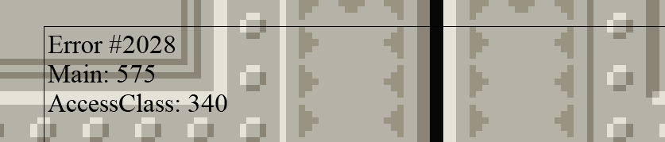
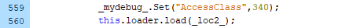

# 概要
デバッグツールが無い場合のデバッグの方法を紹介します。

# 1. try-catch
- 効率 ★☆☆☆☆ 汎用性 ★★★★☆
- エラー箇所付近をtry-catch文で囲みます。```trace()```が使えないので、イニシエダンジョンに入っている関数を使ってエラーログを表示させます。
```as3
try
{
  // エラー箇所
}
catch(err:Error)
{
  // errorCall: Main、PlayScreen、TitleScreenで定義されている関数。
  errorCall(err); 
}

```

> [!CAUTION]
> 一部のエラーはtry-catchに捕捉されないので注意。例えば、定義されていない関数や変数を呼び出すと、catchが呼び出されずに処理が終了します。

# 2. while
- 効率 ★★☆☆☆ 汎用性 ★★★★★
- 以下のコードを置き、ウィンドウが固まればエラー位置はwhileの後方、ウィンドウが固まらなければエラー位置はwhileの前方になります。
- この作業を複数回繰り返し、エラー箇所を特定します。
```as3
while(true)
{
}
```
> [!NOTE]
> - これが一番お手軽で確実です。
> - コードが長くなるとデコンパイルする時間がネックになります。

# 3. a()
- 効率 ★★☆☆☆ 汎用性 ★☆☆☆☆
- 存在しない関数を実行しようとすると処理が終了するので、while付近のエラー特定に使えます。
```as3
while(true)
{
  // エラー箇所
  a()
}
```

# 4. converter.py
- 効率 ★★★★☆ 汎用性 ★★★★☆
- [tools](/tools)にある、converter.pyとDebug.asを使う。
- 疑似的なスタックトレースが使えるようになる。
- ツールの使い方は[ツールの説明.md](ツールの説明.md)を参照。

- 例えば以下のようなエラーが出たら


- 該当部分を見ると、`Main.myAccess.access()` の途中、`this.loader.load()`でランタイムエラー#2028が発生したことが分かります。
  



- ランタイムエラー#2028は`ローカルに配置されたswfファイルからインターネットにアクセスできない`というエラーなので、コードを辿ると、_loc2_に`http://inishie-dungeon.com/inishie.cgi`というURLが設定されていることが原因だと分かります。

> [!NOTE]
> ↓ ランライムエラーのコードはここで確認できます。
> [https://help.adobe.com/ja_JP/FlashPlatform/reference/actionscript/3/runtimeErrors.html](https://help.adobe.com/ja_JP/FlashPlatform/reference/actionscript/3/runtimeErrors.html)

> [!CAUTION]
> 一部のエラーはtry-catchに捕捉されないので注意。例えば、定義されていない関数や変数を呼び出すと、catchが呼び出されずに処理が終了し、エラー画面が表示されません。
> (`2. while`と併用すると良い)

