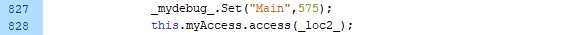

> [!WARNING]
> デバッグツールが無い場合のデバッグ方法です。

# 1. try-catch
- エラー箇所をtry-catch文で囲みます。```trace()```が使えないので、イニシエダンジョンに入っている関数を使ってエラーログを表示させます。
```as3
try
{
  // エラー箇所
}
catch(err:Error)
{
  // errorCall: Main、PlayScreen、TitleScreenで定義されている関数。
  errorCall(err); 
}

```

# 2. while
- 以下のコードを置き、ウィンドウが固まればエラー位置はwhileの後方、ウィンドウが固まらなければエラー位置はwhileの前方になります。
- この作業を複数回繰り返し、エラー箇所を特定します。
```as3
while(true)
{
}
```

# 3. a()
- 存在しない関数を実行しようとすると処理が終了するので、whileで固まる箇所のエラー特定に使えます。
```as3
while(true)
{
  // エラー箇所
  a()
}
```

# 4. converter.py
- toolsフォルダにある、converter.pyとDebug.asを使う。
- 疑似的なスタックトレースが使えるようになる。
- ツールの使い方は[ツールの説明.md](ツールの説明.md)を参照。

- 例えば以下のようなエラーが出たら


- `Main.myAccess.access()` の途中、`this.loader.load()`でランタイムエラー#2028が発生したことが分かる。
  



- ランタイムエラー#2028は`ローカルに配置されたswfファイルからインターネットにアクセスできない`というエラーなので、
- コードを読むと、`http://inishie-dungeon.com/inishie.cgi`というURLにアクセスしようとしていることが原因だと分かります。

### ランタイムエラー エラーコード一覧
[https://help.adobe.com/ja_JP/FlashPlatform/reference/actionscript/3/runtimeErrors.html](https://help.adobe.com/ja_JP/FlashPlatform/reference/actionscript/3/runtimeErrors.html)


# 5. Haxeに変換
> [!WARNING]
> 未検証。
- ax3というツールを使って、as3をHaxeに変換して、Haxeでデバッグする。
- ax3: [https://github.com/innogames/ax3](https://github.com/innogames/ax3)
